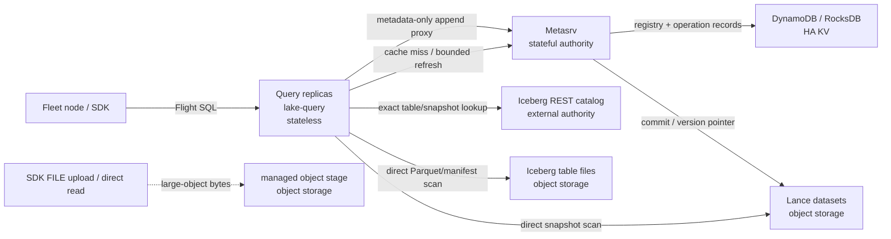
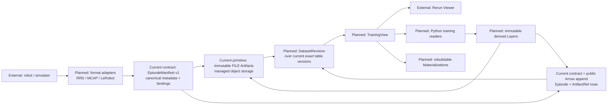
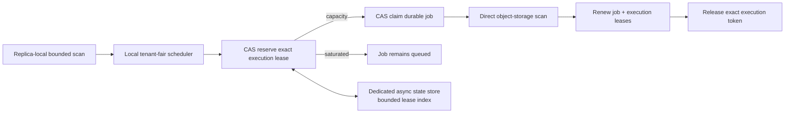

# Architecture

System design for lake. `goal.md` says why; this file says how. Agent
entry points (`AGENT.md`, `CLAUDE.md`) are catalogs — the substance lives
here.

## Design ethos

**Stateless fan-out in front, bounded stateful authority behind.** The read
flood (fleet nodes requesting episode data, DDoS-like) lands on a stateless
query layer that scales horizontally and reads storage directly. The
metadata authority — which tables exist, where, what version — is a small
stateful tier the query layer shields behind a cache. Compute and storage
are disaggregated: throughput scales by adding query nodes, not by growing a
central store.

## At a glance

Open the source-controlled [architecture overview](assets/architecture-overview.html)
when a rendered systems diagram is more useful than a text walkthrough. The
diagram deliberately separates control-plane metadata from object bytes; it is
an implementation map, not an aspirational product diagram.



Two rules make this diagram useful in practice:

| Plane | Carries | Does not carry | Scaling boundary |
|---|---|---|---|
| SQL/control | Flight SQL, catalog generations, schemas, table versions, `DataLocation` metadata | video/model bytes, storage credentials, mutable file lists | Query cache shields Metasrv from read fan-out |
| object data | immutable table files and managed large objects | registry CAS, append coordination, user SQL | SDK and Query stream directly to object storage |

The external-Iceberg connector follows the same boundary: its catalog
remains the authority for Iceberg metadata and snapshots, while Lake Query
caches and reads it as a distinct, read-only SQL catalog. It does not put
external Iceberg metadata in Lake's registry. See
[Iceberg federation](design/iceberg-federation.md) and the focused
[federation topology](assets/iceberg-federation.html). The topology makes one
extra property explicit: Flight tickets pin the external snapshot selected at
planning, but object bytes continue to travel directly between Query and the
Iceberg table's object storage.

## Planned robot-training data model

This section distinguishes implemented contracts from the target model. Today
Lake provides the underlying immutable `DataLocation`, exact per-table versions,
managed-object reads, SQL primitives, and the format-neutral
`EpisodeManifestV1` plus `EpisodeBundleV1`/`ArtifactRefV1` contracts with
canonical JSON, exact Artifact binding, validated Arrow encoding, and a public
bounded exact-schema Arrow append path. Episode-specific ingestion conveniences,
format adapters, DatasetRevision and TrainingView APIs, Python readers,
Materializations, and derived-Layer append are planned work.

In the target model, Lake is authoritative for Dataset membership,
DatasetRevision identity, access, retention, TrainingView selection, and
provenance. Rerun is a first-class visualization, temporal-query, and
training-runtime adapter; its catalog is never an independent source of truth.
The full terminology, current capability boundary, and delivery sequence live in
[`robot-training-lakehouse.md`](design/robot-training-lakehouse.md).



The logical and physical identities are deliberately separate:

- an Episode is the unit selected, split, and attributed for training;
- an Artifact is one complete immutable object identified by `DataLocation`;
- one Episode may reference several Artifacts;
- one physical shard may contain several Episodes;
- a Layer adds annotations, predictions, embeddings, or quality output without
  rewriting a base Recording;
- a DatasetRevision pins authoritative table state, while a TrainingView adds
  selection, Layers, split, sampling, and provenance;
- a Materialization is a derived RRD, LeRobot layout, codec index, or cache that
  may be discarded and rebuilt from its TrainingView.

Format adapters run at ingestion and client/runtime seams. They extract
filterable Episode metadata and build immutable manifests before append. They
may interpret RRD timelines, MCAP topics, or LeRobot shard offsets on reads, but
no format type enters `lake-engine`, `lake-metasrv`, or `DataLocation`.

Robot-training reads therefore have two levels: Lake SQL selects across
Episodes at an exact DatasetRevision, then a format-aware runtime aligns and
decodes data within each Episode. Query and Metasrv continue to carry metadata
only; Recording bytes and byte-range reads go directly between clients and
object storage. No per-sample training request may reach Metasrv.

## Three tiers

```
Fleet nodes / users            millions of reads, DDoS-like fan-out
    │  Flight SQL, load-balanced
    ▼
Query layer   (lake-query)     STATELESS — fan out freely
    - accept SQL, plan + execute via DataFusion
    - read data files directly from object storage (disaggregated storage)
    - cache registrations (db→table→location+version) with TTL;
      cache immutable providers by exact generation with bounded capacity
    │  cache miss / refresh / writes
    ▼
Metadata layer (lake-metasrv)  STATEFUL — bounded, leader-elected
    - authority for the db→table registry and current versions
    - serialize writes / durable idempotent commit coordination
    - background coordination (GC, compaction scheduling)
    │
    ▼
Metastore     (lake-meta)      HA KV: DynamoDB (prod) / RocksDB (dev)
    - registry pointers + compact operation records (durable, HA)
    ▼
Storage engine (lake-engine + lake-engine-lance)
    - per-table datasets on object storage (immutable, cacheable)
```

The query layer is both the compute fan-out and the cache shield. Because
the registry is small (~10⁴ tables) it fits in memory on every query node,
so catalog reads are served locally and the metadata authority sees only
cache-miss and write traffic. That is why the metadata tier being hard to
fan out is acceptable — it is not on the hot read path.

Production Query does not program against the registry KV interface. Its
read-only `CatalogSource` is an authenticated Metasrv Flight client exposing
only delegated point resolution and a versioned conditional directory
snapshot—no CAS, raw key, prefix scan, or delete. `catalog_snapshot` accepts
the last opaque generation and returns `not_modified` or one canonical
directory assembled between matching generation reads. Metasrv retries a
racing generation at most three times, scans in 64-entry pages, accounts each
entry before retaining it, and caps entries, individual schema IPC, generation
tokens, and the serialized response. One process admits at most one full
snapshot construction and retains that admission until the response is dropped.
Only QueryService, MetadataPeer, and Admin identities may read the full
directory. User principals remain namespace-scoped.

Each query replica also keeps a capacity-bounded DataFusion provider cache.
The key includes table name, engine, physical location, incarnation, and
registry version. Concurrent SQL planning for one generation coalesces into
one engine open/provider build. An append changes the version; drop/recreate
changes the incarnation, so neither can reuse a stale provider. Old immutable
providers remain safe for in-flight readers and disappear through normal
eviction. Missing or failed loads are never cached.

Catalog listing refresh is startup-strict and runtime-available. A replica
must connect to Metasrv and synchronously publish its first complete catalog
generation before it is ready. After that, an expired request-path check serves the immutable
last-good generation immediately and admits at most one tracked background
revalidation. A failed scan records bounded process-local health without
replacing the snapshot; a later successful scan atomically publishes the
replacement and clears failure state. Query shutdown aborts and joins the
tracked request-triggered task, while the scheduled server refresher is owned
directly by the server cancellation token. All fallible address/security/TLS
configuration and the first catalog connection fail before Query binds. Warm
directory checks usually return `not_modified`; warm registration and listing
hits perform no metadata RPC. The Lance engine may still use physical manifest
KV while opening object-store datasets; separating that storage metadata into
a least-privilege table/credential is distinct from catalog authority and is
not implied by this boundary.
All of that setup precedes task creation; a drop guard also cancels and aborts both refresh
paths if the serve future itself is cancelled.

Steady refresh is generation-gated after an explicit mixed-writer rollout
finalization. Registry create/delete atomically move an opaque directory
generation; append version changes do not. An unchanged generation costs one
conditional RPC whose Metasrv handler performs one generation point read and
skips the `tbl/` scan. A changed generation is read again after the paged scan,
and a moving candidate is discarded with bounded retry while the last-good
snapshot remains published. Before the monotonic authority marker exists, the
remote action fails closed; only the explicitly local development adapter
retains legacy full-scan compatibility. See
[Catalog directory generations](design/catalog-directory-generation.md).

The published listing is an immutable `Arc<CatalogGeneration>` containing both
namespace/table names and their registry schemas. DataFusion sync listing and
each Flight discovery request clone only that Arc, then read names and schemas
from the pinned allocation. Refresh builds a private replacement and swaps one
pointer after the complete scan, so an in-flight response cannot combine two
generations and request startup does not deep-clone the full catalog. Flight
table discovery applies catalog/schema/table/type filters before schema
resolution and row allocation, so filtered requests pay for matching rows.
Schema and table discovery share the replica Query admission semaphore and
hold a permit until the Flight stream completes or is dropped. Responses are
built lazily in fixed-size batches (256 rows by default); the first match after
the configured 10,000-row default maximum terminates the stream with
`ResourceExhausted`.

### Why the tiers scale differently

- **Query layer is stateless** — no durable state, no coordination. HA and
  scale come from running N replicas behind a load balancer. This is the
  tier that grows with read load.
- **Metadata layer is stateful** — writes must be serialized, background
  jobs need a single coordinator, and the in-memory authority must not
  diverge across replicas. So it is a small leader-elected group (leader +
  standby), durable state in the HA KV. It does not fan out freely; it does
  not need to, because the query cache absorbs the reads.

### Mapping to GreptimeDB

lake reuses GreptimeDB's frontend/metasrv split and drops its datanode tier:

| GreptimeDB | lake | property |
|---|---|---|
| `frontend` (stateless SQL, catalog cache) | `lake-query` | fan out freely |
| `metasrv` (leader-elected authority, DDL coordination) | `lake-metasrv` | stateful, bounded |
| `datanode` (owns region storage) | *none* | storage is shared object store; query reads it directly |

Adopted: the `KvBackend` trait shape (`src/common/meta/src/kv_backend.rs`),
the `KvBackendCatalogManager` + moka cache pattern
(`src/catalog/src/kvbackend/`), lease-in-KV leader election
(`src/common/meta/src/election/`). Rejected: etcd as the backend (we lean on
DynamoDB's managed HA instead), and the datanode tier (disaggregated
storage removes it).

## Storage engine abstraction

Lake must be able to swap Lance for a self-built engine, so no crate above
`lake-engine-lance` may name a `lance::` type — the same confinement rule
RocksDB has inside `lake-meta`. The engine trait exposes only what the
catalog and metadata layers call:

```rust
#[async_trait]
pub trait TableEngine: Send + Sync {
    async fn create(&self, loc: &TableLocation, schema: SchemaRef) -> Result<TableHandleRef>;
    async fn open(&self, loc: &TableLocation) -> Result<Option<TableHandleRef>>;
    async fn maintain(&self, loc: &TableLocation, version: Version) -> Result<Option<Version>>;
}

#[async_trait]
pub trait TableHandle: Send + Sync {
    fn schema(&self) -> SchemaRef;
    fn current_version(&self) -> Version;
    /// A DataFusion table at a specific snapshot — this is how the query
    /// layer reads.
    async fn table_provider(&self, version: Version) -> Result<Arc<dyn TableProvider>>;
    /// Append one identified operation, producing one immutable version.
    async fn append(
        &self,
        operation: &AppendOperation,
        batches: SendableRecordBatchStream,
    ) -> Result<Version>;
    /// Discover an earlier commit after a lost response or failover.
    async fn reconcile_append(&self, operation: &AppendOperation) -> Result<Option<Version>>;
}
```

Lance-on-S3 commit arbitration stores one mutable current manifest pointer per
physical dataset plus immutable historical records. The current pointer is a
single O(1) metastore read. To advance it, the adapter archives the exact prior
pointer and CASes current from exact old bytes to the new staging manifest;
Lance has already durably written staging before that call. A legacy dataset
without the fixed pointer performs one history scan and CAS-installs the
maximum record. External history retention is separate from latest resolution:
cleanup may delete a record only after Lance's tag/branch-aware cleanup proves
the corresponding manifest object obsolete (#42).

Drop never returns the fixed key to an absent state: it CASes current to
`deleting`, clears immutable history, then CASes to a durable `deleted` marker.
Recreate replaces only `deleted`. This tombstone prevents a migration that
read legacy history before drop from winning an ABA `None` CAS afterward.
Every history-key creation is a guarded transaction whose guard is the exact
fixed-pointer bytes observed by that writer, so a writer paused before drop
cannot add history after the deletion fence is installed.
The pointer and both deletion states carry a UUIDv7 dataset incarnation.
Advance and finalize preserve it; recreate generates a new one. Consequently,
even recreating the same base URI with identical version and path values cannot
make an old writer's exact guard match again.
Immutable history records carry the same incarnation. Legacy path-only history
is accepted and upgraded on first archive/finalize. Finalizer retries converge
only when both target path and incarnation match, never merely by path.

External manifest history reclamation runs only after Lance's cleanup succeeds;
Lance therefore remains authoritative for tags, referenced branches, and the
retention window. The CLI validates one immutable Lance maintenance policy
before opening storage: keep 10 recent versions by default, configurable within
`1..=10000` through `LAKE_LANCE_RETAIN_VERSIONS`. The same policy is threaded
through local and object-store engine construction. Maintenance then scans a
durable, incarnation-bound page of at most 256 external records and HEADs each
exact stored manifest path. It deletes only confirmed-absent paths, using a
guarded transaction over exact latest and history bytes, then advances the
cursor under the same latest guard. Existing objects—including tagged or
branch-retained manifests—keep their records. A crash before cursor advancement
replays idempotently, while drop/recreate makes stale work fail closed and
clears the old cursor.

The fixed pointer is a commit-protocol boundary. A pre-pointer binary can write
a newer per-version record without advancing it, so commit-capable binaries on
both sides must not run concurrently. Deployments drain writes, upgrade every
metadata node that may lead, then resume. Dataset data itself needs no offline
migration; the first post-upgrade open installs its pointer lazily.

`Version` is an opaque engine-defined identifier; the registry stores it but
does not interpret it. The Lance impl (`lake-engine-lance`) maps `append`
and versioning onto Lance's own commit + `ExternalManifestStore` (which is
itself a put-if-not-exists KV — see below). A self-built engine implements
the same trait over its own format, using `lake-meta`'s CAS directly.

## Metadata: two levels, not one

There are three distinct pieces of metadata, owned by different layers:

1. **Registry** (lake's, in `lake-meta`): which tables exist and where —
   `tbl/<namespace>/<name> → { incarnation_id, location, current_version,
   engine, schema_ipc? }`. The incarnation changes on every successful create,
   so retained operation records cannot cross a drop/recreate boundary.
   The optional opaque Arrow IPC schema keeps old JSON readable while allowing
   Query to answer schema-inclusive Flight SQL discovery locally. Tiny (~10⁴
   entries), fully cacheable, the metadata layer is its authority.
2. **Operation coordination** (lake's, in `lake-meta`): compact CAS records
   keyed by tenant, table, and UUIDv7 operation identity. They contain only a
   payload digest, base/result versions, state, and timestamps. Arrow rows,
   object bytes, credentials, and signed URLs are forbidden.
3. **Drop coordination** (lake's, in `lake-meta`): immutable tombstones keyed
   `drop/<namespace>/<name>`. A tombstone retains the exact old incarnation and
   registration needed to conditionally detach the registry and resume
   idempotent engine cleanup after a crash.
4. **Per-table manifest** (the engine's): the file list, schema, and
   version history of one table. For Lance this is the Lance dataset
   manifest; lake does not reimplement it.

The registry is key/value prefix-scannable with pagination. Metasrv can list a
single `tbl/<namespace>/…` prefix. Each Query replica scans the whole `tbl/`
family on initial warm and directory DDL, while stable refreshes use the opaque
directory-generation point read after rollout finalization. Discovery reads
the immutable process-local generation and performs no request-path authority
lookup.

### Server-authoritative table placement

Remote DDL carries only a table identifier and Arrow schema. The metadata
server derives `TableLocation` from a trusted `TablePlacement`: a local table
root in development, or an S3 bucket plus optional key prefix in production.
Namespace and table names must be safe single path segments before the engine
or registry is touched. Legacy location-bearing requests fail closed; the
server never ignores and never consumes a caller-selected URI.

The policy lives in `lake-metasrv`, above the engine boundary. Engines still
receive an ordinary storage-neutral `TableLocation`, so placement authority
does not couple the metadata or query tiers to Lance. Each HA replica must use
the same placement configuration; only the elected leader materializes a new
table.

## Commit protocol

Writes go through the metadata layer's leader to serialize per-table commits,
then delegate the data commit to the engine. One logical append is identified
by `(authenticated tenant, table, UUIDv7 operation ID)` and a verified SHA-256
digest of its ordered Flight control payload:

1. The SDK uploads object bytes directly to managed storage, encodes only
   `DataLocation` rows, and generates the operation ID once. Ambiguous Flight
   failures reuse the same encoded messages, identity, and digest for a
   30-second bounded window, longer than the 10-second metadata lease. If that
   window expires ambiguously, the error returns a `PendingAppend`; callers can
   resume it throughout operation retention with the same identity and without
   uploading the object again. When SDK checkpointing is configured, that exact
   pending identity and payload are fsynced before the first RPC and can be
   discovered and resumed by a replacement process.
2. Metasrv authenticates the tenant, verifies the digest, claims a durable
   per-table fence, and CAS-creates a compact `reserved` operation record.
3. The engine writes the new immutable version. Lance disables automatic
   append rebase and stores tenant, operation ID, digest, and reference-stage
   identity in transaction properties. Object-reference chunks are staged
   before the manifest is visible.
   A freshly reserved operation takes a no-eager-scan engine path; full
   transaction history is consulted only for replay/recovery or commit
   collision, not for every healthy append.
4. Metasrv records `engine_committed`, CAS-advances the registry pointer only
   after reference lineage is complete, and records the terminal version.
5. A replay or replacement leader loads the durable record and reconciles
   Lance transaction history. An identical replay returns the original
   version; a changed digest conflicts; corrupt or missing recovery evidence
   fails closed.

Reference staging is an operation-derived, durable recovery journal. It remains
for the full lifetime of the coordinator's append-operation record, even after
final sidecars are complete, so every legally admitted exact replay can finish
reconciliation without racing terminal deletion. The leader's bounded
operation GC holds the same table lock used by append, asks the engine to expire
the exact stage, and only then deletes the operation record. Cleanup failure
therefore leaves durable identity for a later retry instead of creating an
untraceable orphan. Missing or recreated tables skip exact-stage cleanup because
their old dataset is governed by the durable drop lifecycle.
Within the stage itself, chunk zero is both the only chunk-count header and the
publication marker. Persisters materialize non-header chunks first and publish
chunk zero last. Expiry cleanup withdraws chunk zero first, then streams a
bounded drain of the operation-dedicated prefix; a missing or lazily vanished
header uses the same drain rather than assuming no chunks remain. The table lock
prevents a legally admitted persister from recreating chunks during expiry.

This changes the staging publication protocol. Commit-capable binaries using
the old header-first publisher must not run concurrently with the new cleanup:
deployments drain writers, upgrade every Query/Metasrv node that may append,
then resume, matching the external-manifest pointer upgrade boundary above.

Terminal coordination records have a configurable retention horizon (seven
days by default). Leader-only cleanup drains consecutive metastore pages under
finite per-tick page and wall-clock budgets, advances its cursor only after a
complete page, stops at end-of-scan without wrapping, and resumes its
process-local cursor on the next tick. Pending records are
reconciled before deletion. IDs older than retention fail closed, and
timestamps more than five minutes in the future are rejected. A FILE
Flight control stream is capped at 64 MiB because multi-GB video/model bytes
belong in object storage, not in Query or Metasrv memory.

Readers (through the query layer's cache) never observe a half-written
version: the pointer only ever advances to a fully-written one. Consistency
is snapshot-by-version with at-most-one-commit staleness on cache-served
reads — acceptable for training/eval, see `goal.md`.

Flight SQL preserves that exact snapshot across its two protocol phases.
`GetFlightInfo` resolves all physical SQL references through the bounded
registration cache, captures table name + engine + unique location +
incarnation + version, and plans through a request-local catalog containing
only those providers. The encrypted ticket carries the canonical bounded
snapshot set. `DoGet` reconstructs the same catalog directly from the claims,
so it neither re-resolves current registry pointers nor falls forward when a
historical engine snapshot has been reclaimed. Unique per-incarnation object
locations are the storage fence for drop/recreate; the incarnation remains in
the claim and provider-cache key.

## SQL over object storage

The public query protocol keeps arbitrary SQL execution read-only. Query nodes
resolve the exact registry version and stream its files directly from S3; SQL
text cannot register arbitrary object-store locations. The one typed write
surface is a Flight `DoPut` command for already-uploaded SQL `FILE` rows:
the SDK sends `DataLocation` Arrow values to query, query proxies the stream
without persisting it, and the metadata leader performs the idempotent append
protocol above. Query forwards tenant scope derived from its authenticated
principal; a caller-supplied tenant string is never trusted.
The original object bytes never enter query or metadata.

Each Metasrv process admits FILE appends before polling their first Flight
message. A request reserves one concurrency slot plus its configured
worst-case control-stream bytes, then holds both through follower forwarding
or local digest validation, decode, engine commit, and response construction.
Defaults are 8 concurrent appends, 100 ms queue wait, 64 MiB per stream, and
256 MiB process-wide buffered control metadata. Reserving the whole per-stream
maximum avoids incremental weighted-permit deadlocks; saturation fails with
`ResourceExhausted`. These budgets cover only small `DataLocation`/scalar
control rows—multi-GB objects continue directly between the SDK and storage.

After a query node receives the metadata leader's append acknowledgement, it
advances that table's local registration epoch and evicts the prior entry.
An older in-flight cache fill is confined to its old epoch and cannot repopulate
the post-ack lookup generation. The same SDK Flight connection
therefore observes its own write immediately; independent query nodes retain
the normal bounded-staleness window until their cache refreshes.

Interactive results stream over `DoGet`. The durable result tier accepts
standard `PollFlightInfo`, persists encrypted snapshot-pinned jobs in a
dedicated CAS store, materializes bounded Arrow IPC parts below a
tenant/query-scoped result prefix, and publishes only an immutable manifest.
Completed part capabilities are redeemed through `DoGet`; the SDK offers both
the `query_async` convenience path and a versioned, bounded, redacted
`AsyncQueryHandle` for explicit submit/poll/resume/cancel across caller and
Query-replica restarts. Initial retries carry one 128-bit submission id and
converge through the same state-record CAS. The complete API and security boundary are in
[`docs/design/sql-api-over-s3.md`](design/sql-api-over-s3.md).

When a deployment opts into global async execution limits, every replica keeps
its local fair scheduler but reserves one exact opaque token in the dedicated
async state store before claiming a job. The compact lease index is the only
cross-replica authority: it is bounded, expires crashed owners, and counts a
domain-separated tenant digest rather than a raw identity. A saturated lease
leaves the job queued; it does not create a global queue or a terminal failure.



Result-part encoding and redemption are streaming and backpressured. A blocking
Arrow IPC writer emits fixed chunks into a bounded async upload channel and
enforces the encoded limit before an object can be published. On download, a
fixed-window verified reader feeds Arrow's incremental `StreamDecoder`, whose
record batches enter a second bounded channel consumed directly by the Flight
encoder. Before Arrow sees a complete message, a framing validator caps metadata
at 1 MiB, caps declared bodies at the part limit, and rejects compressed IPC so
an untrusted decompressed-length prefix cannot allocate outside the encoded
window. The client-visible stream owns both tasks and shares its admission
permit with the blocking decoder; EOF, error, deadline, cancellation, and drop
have one lifecycle boundary, and admission is released only after that decoder
actually exits. This bounds duplicate serialization buffers; an individual
Arrow batch can still be as large as the external 64 MiB part limit.

Protocol conformance is intentionally not circular: a pinned official ADBC
Flight SQL client black-box tests interactive typed streaming, bearer metadata,
and read-only errors against a real listener. Rust's upstream Arrow Flight
types separately exercise polling, endpoint redemption, and cancellation,
which are below the ordinary ADBC DB-API surface.

## Crate map

| Crate | Owns | Tier |
|-------|------|------|
| `lake-common` | shared newtypes plus format-neutral Episode/ArtifactRef v1 values | — |
| `lake-flight` | shared Flight TLS, bearer authentication, exposure policy, and secure Channel construction | transport |
| `lake-objects` | SQL `FILE` representation, Episode/ArtifactRef v1 Arrow encoding, direct object I/O | storage |
| `lake-meta` | `MetaStore` (KvBackend) trait; `RocksMeta` (dev), `DynamoMeta` (prod) | metastore |
| `lake-engine` | `TableEngine` / `TableHandle` traits + shared types | storage |
| `lake-engine-lance` | Lance impl and `ExternalManifestStore` adapter; the ONLY crate that names `lance::` | storage |
| `lake-catalog` | db→table registry logic, DataFusion `CatalogProvider`, moka cache | query + metadata |
| `lake-query` | stateless query-layer server (Flight SQL, DataFusion execution) | query |
| `lake-metasrv` | stateful metadata-layer server (registry and table-placement authority, write coordination, leader election) | metadata |
| `lake-cli` | thin `clap` binary: subcommands to run each server + client | — |
| `lake-sdk` | Rust streaming SQL query, parameterized `FILE` INSERT, `DataLocation` decoding, and direct reader | client |

Conventions: **thin libs** (`lib.rs` is module docs + re-exports; logic in
sub-files), **async-first** (engine, metastore, catalog, servers are async;
sync bridges only at framework boundaries, each with a `ponytail:` note),
per-crate snafu errors (`{CrateName}Error` + `Result<T>`), `anyhow` only in
`lake-cli`. Each crate carries an `AGENT.md` card. Workspace lints/deps live
in the root `Cargo.toml`.

`schema` is not a crate: it is Arrow `SchemaRef`, owned by the engine and
surfaced through `lake-catalog`.

## HA

- **Query layer**: stateless → N replicas behind a load balancer.
- **Metadata layer**: leader + standby; leader elected via a lease in the
  HA KV (GreptimeDB's `election` pattern). Durable state lives in the KV, so
  a failed leader loses no data — a standby takes the lease and resumes. The
  lease record carries a monotonic fencing epoch. `MetaStore::guarded_mutate`
  atomically checks the exact lease record together with an exact target
  create, update, or delete: RocksDB uses one writer critical section and
  write batch; DynamoDB uses one `TransactWriteItems` request. Backends without
  a native atomic implementation fail closed.
- **Metastore**: DynamoDB is multi-AZ HA by construction; RocksDB is
  single-node, dev only. Dynamo's legacy table remains the authority until a
  verified migration marker exists. Current nodes atomically dual-write a
  companion `(family#shard, full-key)` table; after finalization, point reads
  use strongly consistent `GetItem` and prefix reads drain bounded,
  strongly-consistent `Query` pages across 8 registry/default, 32 manifest, or
  64 append shards. Finalization pauses metadata writes with a durable barrier
  and publishes the marker only after bidirectional parity succeeds. See
  [`dynamo-prefix-layout.md`](design/dynamo-prefix-layout.md).

No self-built consensus: read HA comes from stateless replicas, write HA
from lease-election over an already-HA KV.

Production Metasrv wraps its raw metastore in a lease-fenced view after
election starts. Each registry, append-operation, and maintenance CAS/delete
loads the latest exact lease bytes immediately before publication and executes
through `guarded_mutate`; election renew/resign continues on the raw store.
Within one process, the metastore transaction takes a shared publication
barrier while renewal/resign holds its exclusive side from durable lease CAS
through local guard publication. This closes the exact-bytes rotation window
without holding the barrier across long engine work. Long engine operations
can therefore span same-holder renewals, while a takeover changes the guard
and rejects a paused former leader. If the old leader already committed an
engine version, the successor reconciles that immutable commit before
publishing it.

Destructive table drop is a persisted idempotent procedure because object
deletion cannot share the KV transaction. Metasrv first guarded-CAS creates an
immutable incarnation tombstone, guarded-deletes the exact registry pointer,
idempotently removes the old engine location, and finally guarded-deletes the
exact tombstone. Leader maintenance resumes a cursor-paged bounded set of
unfinished tombstones. Remote creates use
`<root>/<namespace>/<table>/<uuid>.lance` (or the equivalent S3 prefix), so an
old leader that continues object deletion after takeover can touch only the old
physical generation. A replacement incarnation therefore remains safe even
though object-store deletion itself is not lease-transactional.

## Deliberate simplifications (ponytail markers)

Grep for `ponytail:` in code for shortcuts with known ceilings. Current
design-level ones:

- Both servers speak real Arrow Flight: `lake-query` a streaming Flight SQL
  read endpoint plus a typed metadata-only FILE `DoPut` proxy, and
  `lake-metasrv` a Flight control plane accepting DDL actions and leader-aware
  FILE append streams.
  `lake-metasrv::serve` runs deadline-aware lease election, forwards follower
  writes to the observed leader, serializes mutations per table, and gates
  maintenance on the same lease. Durable asynchronous queries deliberately use
  a separate injected state store rather than this catalog/control-plane
  authority. That store also owns a point-addressed, SHA-256-domain-separated,
  bounded tenant reservation index. Submission reserves before object upload;
  cleanup releases only after scoped objects and the exact state record are
  deleted. Schema-v2 records persist the per-job result byte ceiling, while v1
  records retain their legacy protocol ceiling. CAS and reconciliation work is
  bounded; ambiguous crashes may over-count temporarily but never under-count
  a live durable job.
- Every production Flight hop shares `lake-flight`: a server interceptor
  authenticates every RPC, TLS configuration is verified by the client, and
  non-loopback plaintext/anonymous listeners fail closed. This covers
  SDK→Query, Query→Metasrv, and follower→leader. A protected immutable
  principal map binds opaque credentials to validated tenant, role, and finite
  namespace grants. Query rejects unauthorized SQL before planning and filters
  discovery from its local catalog snapshot. Metasrv independently checks every
  table action and FILE append; only authenticated Query/metadata-peer roles may
  preserve an exact authorized namespace across internal hops. Loopback
  development installs an explicit development principal rather than treating a
  missing identity as authority.
- Flight SQL statement handles remain standards-compatible outer
  `TicketStatementQuery` messages, but their payload is a versioned
  AES-256-GCM envelope rather than raw SQL. It binds principal, tenant,
  audience, issued-at, and expiry and is opened before authorization,
  admission, catalog refresh, or planning. Every production Query replica
  shares a bounded active/verification key ring; loopback-only development may
  generate an ephemeral key. Exact table-version snapshot pinning between `GetFlightInfo` and `DoGet` is implemented through encrypted ticket claims and request-local pinned catalogs.
- Managed-stage discovery derives `tenants/<tenant-id>` below the configured
  local root or S3 prefix. The SDK opens that child stage directly and rejects a
  `DataLocation` outside it. Production workload IAM must independently restrict
  each SDK identity to the same S3 child prefix; Lake never sends AWS credentials
  or large-object bytes through Query or Metasrv.
- The full prod path (Lance on S3 + DynamoDB commit pointer via
  `ExternalManifestStore`) is wired end to end: `LanceEngine::for_object_store`
  threads S3 storage options + the commit handler through create/open/append,
  and `lake-cli` selects it via `LAKE_S3_BUCKET` plus the independent
  `LAKE_MANIFEST_DYNAMODB_TABLE`. Served Query constructs a minimal context
  with that physical-manifest handle but no catalog `MetaStore`, Metasrv, table
  placement, or Dynamo provisioning path. Its IAM is read-only on the manifest
  table pair and absent on `LAKE_DYNAMODB_TABLE`; Metasrv holds the separate
  registry authority and the manifest write authority. Equal table names fail
  before I/O. Query's manifest adapter rejects commit/delete and missing legacy
  latest-pointer migration before KV mutation, so read-only IAM is real rather
  than documentary; no legacy shared-table fallback exists. Verified against
  localstack both directly
  (`tests/s3_lance_localstack.rs`, `#[ignore]`) and through `lake selftest` in
  cloud mode.
- The Rust SDK has a finite table-schema cache shared by client clones. It
  singleflights same-table misses, retains only successful lookups, expires
  entries after a bounded TTL, and exposes explicit per-table/full invalidation
  for coordinated replacement. This removes per-row schema planning without
  weakening Query/Metasrv append validation.
- The Rust SDK also accepts 1..=10,000 rows across caller-owned, non-empty Arrow
  batches. It rejects zero-row, inconsistent, oversized-buffer, or
  authoritative-table-schema-mismatched input before `DoPut`; exact protobuf
  sizes are accumulated incrementally and stop at the 64 MiB Flight ceiling.
  At most 10,001 messages (one schema plus one hydrated record message per row)
  enter either the memory-only or durable checkpoint path. Both reuse the same
  UUIDv7 identity, digest, and ambiguous-result retry machinery as scalar/`FILE`
  inserts. Query-only clients can use this path because existing `DataLocation`
  values are metadata; no object discovery, upload, or byte proxy occurs.
- Each stateless Query replica has finite process-local admission: bounded
  concurrent planning/execution, bounded queue wait, a stream-held execution
  deadline, and pre-planning SQL/ticket size checks. Authenticated tenants first
  acquire a finite tenant gate and only then enter the global FIFO under one
  deadline; a bounded weak registry reclaims inactive gates without background
  work. This protects one replica without adding metadata traffic or exporting
  identities. Durable async workers separately use bounded page candidates,
  per-tenant round-robin selection, a process-local tenant ceiling, and an
  absolute execution deadline; saturated tenants never park a worker slot.
  An opt-in compact shared execution-lease index additionally bounds running
  async work globally and per tenant across replicas; it is acquired before a
  worker claim and uses expiry plus opaque-token fencing, not a leader or
  global queue. Durable retained async storage is additionally bounded by a CAS
  tenant index and immutable record-level result-byte ceiling. Cluster-global
  CPU/memory quotas, billing, and strict execution-dispatch fairness remain
  future work.
- Each Metasrv replica separately bounds concurrent FILE appends and reserves
  worst-case buffered control bytes before reading a request. A follower and
  leader each enforce their own local ceiling while one forwarded upload is in
  flight; per-tenant and distributed write quotas remain policy work.
- Leader maintenance consumes one bounded registry-registration page per tick,
  rather than listing every namespace and table. Its process-local opaque
  cursor wraps after the final page; every candidate is point-read again under
  its table lock so drop/recreate cannot expose a stale scanned generation.
- The same tick drains multiple append-operation pages under independent page
  and wall-clock budgets. It remains serial and cancellation-aware so
  increasing cleanup throughput cannot bypass per-table locks, exact-stage
  cleanup, or indefinitely starve the later table-maintenance page.
- Query's DataFusion runtime is also process-bounded: all concurrent operators
  share one fair execution-memory pool and one aggregate size-limited spill
  manager under an operator-owned local directory. Spill is ephemeral replica
  state and is deleted with its DataFusion runtime; it never becomes table or
  query-result durability.
- Query and Metasrv expose injected shutdown futures; the CLI maps SIGINT and
  SIGTERM into them. Tonic stops accepting connections and drains existing
  Flight RPCs within a finite deployment-configured grace period. Query joins
  catalog refresh before return. Metasrv uses that grace as one total deadline:
  it stops maintenance at table boundaries, keeps renewing leadership while
  accepted writes drain, drops the server on clean completion or timeout, and
  only then resigns while joining maintenance, campaign, and readiness
  monitoring concurrently.
  Unfinished owned tasks are aborted and reaped at the deadline. This ordering
  prevents an accepted write from committing after the node has released
  authority. Flight or background drain timeout is a typed process error, not
  a clean exit.
- Managed large objects have a query-connected Rust SDK vertical slice:
  `INSERT ... VALUES (?, ?)` binds `InsertValue::File(FileUpload)`, streams it
  into either a local or S3 Lake-owned managed stage, and stores an immutable
  `DataLocation` physical representation in Lance. S3 uses bounded multipart
  upload and exact bucket/prefix validation for direct reads. SDK-configured
  local checkpoints make path-backed multipart writes resumable across process
  restarts: source/stage identity and per-part hashes are revalidated against
  paginated S3 state before only the missing suffix is sent. Sequential and
  half-open byte-range readers share the same SDK/storage boundary. Full opens
  validate the DataLocation hash before I/O and incrementally verify declared
  size plus SHA-256 at EOF with constant memory; malformed, short, long, and
  same-size corrupt identities fail closed. Local ranges seek and S3 ranges
  issue one bounded GET; S3 verifies the response's exact Content-Range and
  Content-Length before exposing its body, while both stage and SDK readers cap
  the interval and fail closed on a short range stream. Partial intervals make
  no whole-object integrity claim. The
  SDK can group 1..=10,000 fully validated rows into one Arrow batch and one
  append operation. FILE uploads remain sequential and directly target the
  managed stage, so object-byte memory and metadata commits do not scale with
  one another. Caller metadata and accumulated returned locations each have a
  16 MiB ceiling, and the final 64 MiB Flight ceiling uses protobuf encoded
  lengths identical to Metasrv admission. The SDK receives only the query
  endpoint, discovers a credential-free managed stage descriptor once, and
  constructs local/S3 access using process credentials; query forwards metadata
  to the leader-aware metasrv. A credentialed SDK process can mint a 1s..=1h
  S3 GET capability only after the same tenant child-prefix validation used by
  direct reads. The opaque result redacts URL/header values from Debug, signing
  performs no GET, and consumers may add Range while retaining any required
  signed headers. A credentialless SDK process uses `connect_query_only` plus
  the explicit `presign_read_via_query` action instead: it neither discovers a
  managed stage nor creates an object-store client. Query authenticates first,
  derives the exact `tenants/<tenant-id>` S3 stage, validates the
  `DataLocation`, and then delegates the bounded signing operation to its
  optional S3-only issuer. No signed URL, header value, credential, or object
  bytes reaches Arrow, Query persistence, or Metasrv. Local Query deployments
  install no issuer and fail the action closed. `open_via_query` and
  `open_range_via_query` consume that capability internally with one shared
  Rustls HTTP client whose redirects and caller/system proxies are disabled;
  their response bodies stream directly between the SDK and object storage. A
  full read retains the
  constant-memory SHA-256-at-EOF check; a range read sends the exact bounded
  interval and requires an exact `206 Content-Range` plus content length before
  it exposes a reader. Signed URL/header-bearing transport failures map to
  opaque SDK errors, and dropping the reader drops the response body rather
  than draining it in the background. Codec indexes remain deferred.
  When the operator configures the SDK checkpoint directory, the exact append
  operation also becomes restart-durable before its first RPC: UUIDv7 identity,
  encoded metadata, stage identity, and integrity digest are atomically fsynced
  without object bytes or credentials. Bounded discovery loads one selected
  operation under the Flight ceiling and revalidates its descriptor/digest.
  Ambiguous outcomes retain it; conclusive outcomes remove it. Post-commit
  process loss therefore replays to the original version instead of creating a
  second logical insert.
- Managed-object reachability is incremental rather than a table-row scan.
  Every version-producing Lance commit publishes a canonical chunked
  reference edge before the registry pointer can advance. The separate
  `lake gc` worker pages those edges and storage inventory, externally merges
  live URIs with bounded memory/open files, age-gates candidates, and publishes
  an immutable content-addressed plan only after full validation. Explicit
  apply verifies the stage and registry-root fingerprint before each bounded
  page and fsyncs a resumable checkpoint. Each complete registry-root
  validation uses one typed metastore prefix scan, rather than namespace
  listing plus one point read per table. Missing lineage, registry movement,
  stale/corrupt plans, prefix escapes, and future removal deltas all fail
  closed. The operational safety horizon must exceed upload-to-commit retries;
  apply runs in a write-quiescent window.
- The CLI application boundary installs a process-wide tracing subscriber
  before parsing commands or opening resources. Existing Query and Metasrv
  operational events therefore reach newline-delimited JSON stderr by default;
  deployments may select pretty output and standard `RUST_LOG` filtering.
  Startup events exclude argv, SQL, paths, and credentials. Both servers expose
  authenticated standard gRPC Health on their existing TLS port: the empty
  service is process liveness, while Flight readiness follows Query catalog
  warmup or Metasrv's usable local-lease/remote-leader route. Graceful shutdown
  withdraws both before connection drain. An opt-in, loopback-only Prometheus
  endpoint exposes bounded Query saturation/catalog signals and Metasrv
  append/leadership/maintenance signals. Its listener and upkeep work are
  owned by the server lifecycle, and labels never contain workload or object
  identities. A hardened container and Kubernetes reference now preserve the
  tier split, authenticated health, private metrics, finite shutdown, and
  bounded resources in a scheduler. Opt-in OTLP/gRPC tracing uses a bounded,
  process-owned exporter and W3C context across public Flight,
  Query-to-Metasrv, and follower-forwarding hops. Server span attributes are a
  fixed RPC allowlist and exclude workload, identity, and object data.

## Phasing

- **v0 (core)** ✅ — `lake-common` + `lake-meta` (RocksMeta) + `lake-engine`
  + `lake-engine-lance` + `lake-catalog`, exercised by `lake-cli`'s e2e
  self-check (create → ingest → SQL). All tiers present as libraries.
- **v1 (wires + prod backend)** ✅ — `DynamoMeta` (prod HA KV), the Lance
  `ExternalManifestStore` adapter for S3 commits, the `lake-query` Arrow
  Flight SQL server, and the `lake-metasrv` Flight `do_action` control plane.
- **v2 (metadata HA + ops)** — lease-election, follower forwarding,
  leadership-gated writes, per-table serialization, and leader-only
  maintenance are wired. Structured process logging and authenticated gRPC
  health readiness, bounded Prometheus metrics, and distributed tracing are
  wired. Durable SDK append state and finite client-side schema caching are
  wired. Per-replica foreground and async tenant concurrency isolation plus
  durable retained-job/result-byte accounting and cluster-wide bounded async
  execution capacity are wired; remaining policy work is strict global async
  dispatch fairness plus CPU/memory/billing accounting. A
  self-built engine slots in behind `TableEngine`
  if/when Lance's ceiling is hit.
- **v3 (external Iceberg federation)** — one read-only Iceberg REST catalog is
  exposed as the separate `iceberg` SQL catalog. It retains Iceberg's own
  metadata and commit authority; no external write path, catalog enumeration,
  or registry mirroring is part of this phase. See
  [Iceberg federation](design/iceberg-federation.md).

Invariant across all phases: fleet reads go through the stateless query
layer, never directly at the metadata authority.
