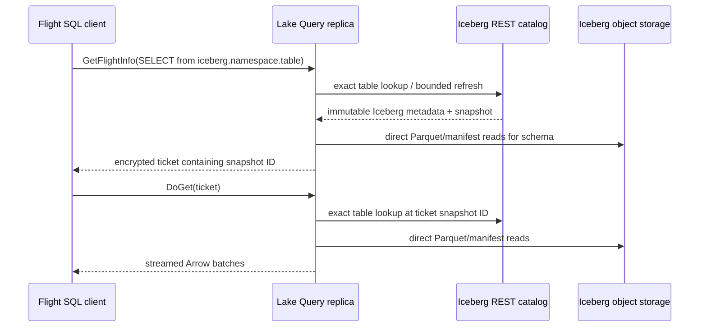

# Iceberg federation

> **Status: implemented (read-only REST federation).** One external catalog is
> configured on each Query deployment. Iceberg writes remain deliberately out
> of scope.

Lake's native storage and commit protocol remain Lance-based. Iceberg is an
external table format with an external catalog and its own snapshot/commit
authority. Treating it as another `TableLocation` owned by Metasrv would merge
two independent commit protocols and break both systems' visibility rules.

## Read-only REST catalog federation

One configured Iceberg REST catalog appears as a separate DataFusion/Flight SQL
catalog:

```sql
SELECT episode_id, reward
FROM iceberg.analytics.episodes
WHERE robot_id = 'alpha';
```

`lake.<namespace>.<table>` remains a Lake-owned table. Its registry is served
by Metasrv, and its current version is Lake's visibility boundary.
`iceberg.<namespace>.<table>` remains an external table. Its REST catalog and
Iceberg metadata determine the snapshot; Lake never mirrors it into the Lake
registry.



The catalog request is a metadata path. The query scan is a direct object-data
path. Neither large objects nor Iceberg credentials pass through Flight SQL,
Metasrv, or the Lake registry.

## Deployment configuration

Query enables federation only when all three values are set before the listener
binds. A partial configuration is a startup error; an unset triple leaves
Iceberg disabled.

| Variable | Meaning |
|---|---|
| `LAKE_ICEBERG_REST_ENDPOINT` | Credential-free HTTPS REST catalog base URL; numeric IP loopback HTTP is development-only |
| `LAKE_ICEBERG_WAREHOUSE` | Iceberg warehouse identifier passed to the catalog |
| `LAKE_ICEBERG_NAMESPACES` | Comma-separated, finite SQL namespace allowlist |
| `LAKE_ICEBERG_REST_TIMEOUT_MS` | Optional per-request total/connect deadline in milliseconds (default `10000`, range `1..=60000`) |

For example:

```bash
LAKE_ICEBERG_REST_ENDPOINT=https://catalog.example.com \
LAKE_ICEBERG_WAREHOUSE=s3://embodied-warehouse \
LAKE_ICEBERG_NAMESPACES=analytics,models \
lake query --metadata-addr https://metasrv.example.com:50052
```

The REST session is either unauthenticated, a static bearer token via
`LAKE_ICEBERG_REST_TOKEN`, or an OAuth client-credentials session via
`LAKE_ICEBERG_REST_CREDENTIAL` (`client-id:client-secret`). The two modes are
mutually exclusive. OAuth may additionally use the standard
`LAKE_ICEBERG_REST_OAUTH2_SERVER_URI`, `LAKE_ICEBERG_REST_OAUTH_SCOPE`,
`LAKE_ICEBERG_REST_OAUTH_AUDIENCE`, and
`LAKE_ICEBERG_REST_OAUTH_RESOURCE` properties; each requires client
credentials. Values are validated before the Flight listener binds, including
the credential-free HTTPS requirement for both external endpoints. Plain HTTP
is valid only for numeric IP loopback development endpoints (`127.0.0.0/8` or
`::1`), not DNS names such as `localhost`; this keeps a bearer token or OAuth
client credential off plaintext remote transport.

The adapter uses Apache `iceberg-rust`'s DataFusion integration at the pinned
Apache revision declared in the workspace. Its storage factory resolves the
table-file URI at scan time. Cloud credentials and REST authentication are
therefore deployment/runtime concerns (for example the normal cloud-provider
credential chain), never Lake registry fields, SQL text, or ticket claims.

Lake builds the upstream REST catalog with its own bounded HTTP client. The
timeout applies to the configuration handshake, namespace point checks, exact
table loads, and OAuth exchanges; it prevents a stalled external authority
from becoming an implicit unbounded startup dependency. It does not add a
retry policy, circuit breaker, or background health task. Query's separate
end-to-end Flight planning deadline remains the outer request boundary.

The Query process passes the validated auth value only to its in-memory REST
client. It is deliberately absent from `Debug` output, errors, metrics, Lake
metadata, table descriptors, and encrypted Flight ticket claims. Deploy it
through the platform secret manager, never endpoint userinfo or a repository
configuration file.

The pinned upstream REST client caches an OAuth access token but does not
refresh it automatically. Lake therefore treats an OAuth failure on one of its
already-bounded metadata reads as a recoverable session failure: it
single-flights one `regenerate_token` call and retries the same namespace check
or exact table lookup once. Static bearer tokens are never refreshed. This is
not a background timer, a credential-discovery mechanism, or a Lake-owned
token service; a renewal or retry failure remains an external catalog error.

Startup performs a bounded existence check for each configured namespace. It
does not list external namespaces or tables. At query time a reference to
`iceberg.analytics.episodes` performs one exact external table lookup; a
namespace outside the allowlist is not visible. Flight table discovery likewise
does not enumerate the external catalog, so clients must address a configured
Iceberg table by its full three-part name.

## Scope and write boundary

The slice supports scans through direct SQL and standard Flight statement
execution. Lake SQL is read-only, so the following are rejected before an
external mutation can begin:

- Iceberg `CREATE`, `DROP`, `ALTER`, `INSERT`, `UPDATE`, `DELETE`, and
  `MERGE` statements;
- an Iceberg commit, manifest write, or catalog update issued by Lake;
- importing or copying Iceberg data into Lake storage as a side effect of a
  query.

## Snapshot and availability rules

An Iceberg table provider is bound to the snapshot chosen while a statement is
planned. A Flight ticket records the namespace, table, and immutable Iceberg
snapshot ID. `DoGet` point-loads that ID and reconstructs a request-local
provider; it never adopts a newer current snapshot after ticket issue. A later
statement can refresh and use a newer snapshot. If upstream retention has
removed the ticketed snapshot, the request fails rather than falling forward.

Each Query replica has a bounded cache of at most 10,000 external table
snapshots. A cache entry is fresh for 5 seconds. On refresh failure, a
last-good entry may be used for up to 60 seconds from its successful load;
after that, the external error is returned. Iceberg-only Flight planning does
not refresh the Lake registry. The external catalog and the Lake catalog have
separate metadata authorities and failure domains.

## Non-goals and the write gate

Read federation does not make Lake an Iceberg writer. Adding writes later
requires a separate protocol review covering Iceberg optimistic commits,
schema/partition evolution, retry/idempotency, table locks, authorization,
and snapshot-expiry/GC ownership. It must prove that one table has exactly one
metadata authority for a given commit. Until then, the external Iceberg catalog
is that authority.
