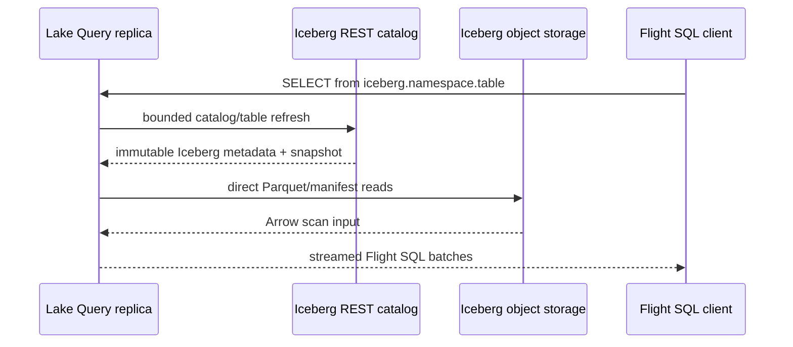

# Iceberg federation

> **Status: planned.** This document defines the first implementation slice;
> it is not a claim that a released Lake binary already queries Iceberg.

Lake's native storage and commit protocol remain Lance-based. Iceberg is an
external table format with an external catalog and its own snapshot/commit
authority. Treating it as another `TableLocation` owned by Metasrv would merge
two independent commit protocols and break both systems' visibility rules.

## First slice: read-only REST catalog federation

One configured Iceberg REST catalog will appear as a separate DataFusion/Flight
SQL catalog:

```sql
SELECT episode_id, reward
FROM iceberg.analytics.episodes
WHERE robot_id = 'alpha';
```

`lake.<namespace>.<table>` remains a Lake-owned table. Its registry is served
by Metasrv, and its current version is Lake's visibility boundary.
`iceberg.<namespace>.<table>` remains an external table. Its REST catalog and
Iceberg metadata determine the snapshot; Lake never mirrors it into the Lake
registry.



The catalog request is a metadata path. The query scan is a direct object-data
path. Neither large objects nor Iceberg credentials pass through Flight SQL,
Metasrv, or the Lake registry.

## Compatibility and scope

The adapter should use the Apache `iceberg-rust` DataFusion integration that
matches Lake's DataFusion/Arrow major versions. The initial catalog type is
Iceberg REST only. The catalog configuration and cloud credentials belong to
the Query deployment; normal cloud-provider credential chains and the external
catalog's authentication mechanism stay outside Lake's persisted metadata and
wire payloads.

The first slice supports scans and Flight discovery only. Lake SQL remains
read-only, so the following are deliberately rejected before an external
mutation can begin:

- Iceberg `CREATE`, `DROP`, `ALTER`, `INSERT`, `UPDATE`, `DELETE`, and
  `MERGE` statements;
- an Iceberg commit, manifest write, or catalog update issued by Lake;
- importing or copying Iceberg data into Lake storage as a side effect of a
  query.

## Snapshot and availability rules

An Iceberg table provider is bound to the Iceberg snapshot chosen while its
statement is planned. A Flight statement ticket must retain that exact provider
through `DoGet`; it must never re-resolve the current external snapshot after
the ticket has been issued. A later request can refresh and plan against a
newer Iceberg snapshot.

Iceberg metadata refresh is bounded and cache-coalesced per Query replica,
just like Lake catalog refresh. A cold configured connector must validate its
configuration before Query is marked ready. Once it has a last-good external
snapshot, a transient Iceberg catalog outage may serve that snapshot until its
documented staleness bound; it must not make Lake-owned catalog reads fail.

## Non-goals and the write gate

Read federation does not make Lake an Iceberg writer. Adding writes later
requires a separate protocol review covering Iceberg optimistic commits,
schema/partition evolution, retry/idempotency, table locks, authorization,
and snapshot-expiry/GC ownership. It must prove that one table has exactly one
metadata authority for a given commit. Until then, the external Iceberg catalog
is that authority.
