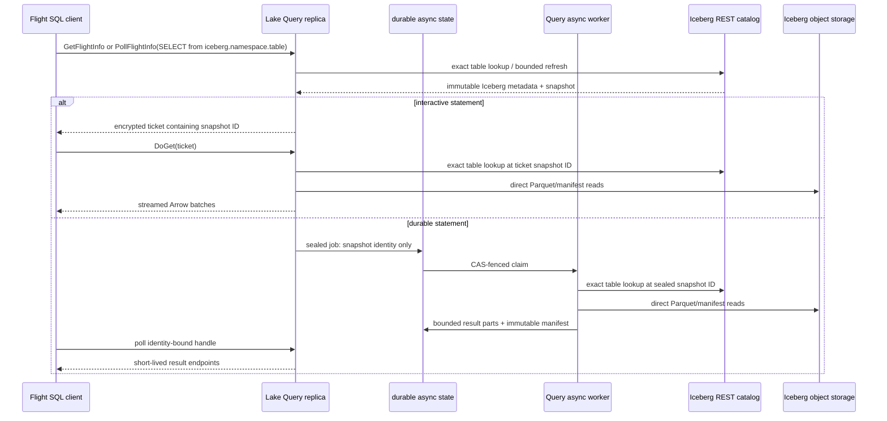
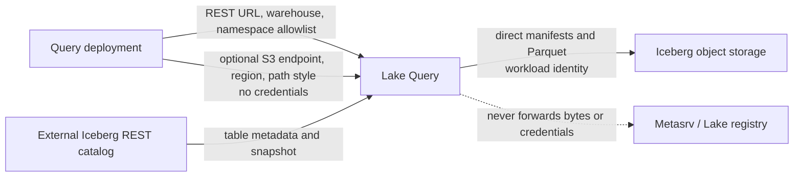

# Iceberg federation

> **Status: implemented (read-only REST federation).** One external catalog is
> configured on each Query deployment. Iceberg writes remain deliberately out
> of scope.

Lake's native storage and commit protocol remain Lance-based. Iceberg is an
external table format with an external catalog and its own snapshot/commit
authority. Treating it as another `TableLocation` owned by Metasrv would merge
two independent commit protocols and break both systems' visibility rules.

## Read-only REST catalog federation

One configured Iceberg REST catalog appears as a separate DataFusion/Flight SQL
catalog:

```sql
SELECT episode_id, reward
FROM iceberg.analytics.episodes
WHERE robot_id = 'alpha';
```

`lake.<namespace>.<table>` remains a Lake-owned table. Its registry is served
by Metasrv, and its current version is Lake's visibility boundary.
`iceberg.<namespace>.<table>` remains an external table. Its REST catalog and
Iceberg metadata determine the snapshot; Lake never mirrors it into the Lake
registry.

Open the source-controlled [federation topology](../assets/iceberg-federation.html)
for the deployment view. It complements the diagram below: both distinguish
the interactive `DoGet` route from the durable `PollFlightInfo` route, while
showing that they share admission, encrypted snapshot pinning, and direct
Iceberg object reads.



The catalog request is a metadata path. The query scan is a direct object-data
path. The durable state holds a sealed statement and bounded result metadata;
it does not hold Iceberg credentials or source-object bytes. Neither those
credentials nor large Iceberg objects pass through Flight SQL, Metasrv, or the
Lake registry.

## Operational read contract

The path below is intentionally narrow. It keeps external metadata authority
out of Lake's registry without allowing a reader fan-out to turn into catalog
enumeration or a per-reader OAuth storm.

| Phase | Query does | Boundary it preserves |
|---|---|---|
| startup | Validates the complete deployment configuration, builds one in-memory REST client, and point-checks each configured namespace before binding Flight. | No partially configured listener; no namespace/table enumeration. |
| statement planning | Authenticates the Flight caller, intersects its Lake namespace grant with the finite deployment allowlist, then resolves one exact table. | A caller cannot make the deployment discover or expose a namespace it was not granted. |
| current-snapshot load | Retains at most 10,000 completed table snapshots and admits at most 64 distinct pending loads. A cold or expired key admits one external lookup; concurrent planners for that same key await its result without taking another pending-load slot. | External catalog state and load work stay bounded; a new distinct key at capacity fails before external I/O. |
| Flight ticket | Encrypts the selected namespace, table, and immutable snapshot ID into the normal statement ticket. | A later catalog change cannot silently change a running statement's source snapshot. |
| `DoGet` | Point-loads the named snapshot and rejects it when upstream retention removed it; then Query reads Parquet/manifests directly from Iceberg storage. | No fall-forward to a newer snapshot; no object bytes through Metasrv or the external REST catalog. |
| `PollFlightInfo` | Persists the same encrypted snapshot ticket in Lake's bounded async-job store. A later worker point-loads that exact ID before materializing immutable Arrow result parts. | Long scans survive client/replica changes without storing external credentials or falling forward to the current snapshot. |

The configured namespace set is only the deployment ceiling. Query also applies
the authenticated principal's ordinary Lake namespace grant to the Iceberg
namespace, so access to `iceberg.analytics.episodes` requires both
`analytics` in `LAKE_ICEBERG_NAMESPACES` and `analytics` in that principal's
grant. This shared namespace policy is authorization only: it does not alias
the external table into the `lake` catalog or add it to Lake's registry.

## Deployment configuration

Query enables federation only when all three values are set before the listener
binds. A partial configuration is a startup error; an unset triple leaves
Iceberg disabled.

| Variable | Meaning |
|---|---|
| `LAKE_ICEBERG_REST_ENDPOINT` | Credential-free HTTPS REST catalog base URL; numeric IP loopback HTTP is development-only |
| `LAKE_ICEBERG_WAREHOUSE` | Iceberg warehouse identifier passed to the catalog |
| `LAKE_ICEBERG_NAMESPACES` | Comma-separated, finite SQL namespace allowlist |
| `LAKE_ICEBERG_REST_TIMEOUT_MS` | Optional per-request total/connect deadline in milliseconds (default `10000`, range `1..=60000`) |
| `LAKE_ICEBERG_S3_ENDPOINT` + `LAKE_ICEBERG_S3_REGION` | Optional pair for a credential-free S3-compatible endpoint omitted by the catalog; both must be set together |
| `LAKE_ICEBERG_S3_PATH_STYLE_ACCESS` | Optional strict `true`/`false`; enables path-style S3 addressing |
| `LAKE_ICEBERG_S3_ALLOW_ANONYMOUS` | Optional strict `true`/`false`; permits reads from an intentionally public bucket |

For example:

```bash
LAKE_ICEBERG_REST_ENDPOINT=https://catalog.example.com \
LAKE_ICEBERG_WAREHOUSE=s3://embodied-warehouse \
LAKE_ICEBERG_NAMESPACES=analytics,models \
lake query --metadata-addr https://metasrv.example.com:50052
```

### Object-store configuration boundary

The REST response remains the normal source of file-I/O properties. The S3
override is only for compatible external catalogs that omit a non-default
endpoint; its client-side properties take precedence for the one Query process.
It is intentionally not a general property pass-through and never carries
credentials.



`LAKE_ICEBERG_S3_ENDPOINT` must be paired with
`LAKE_ICEBERG_S3_REGION`. It follows the catalog's credential-free
HTTPS-or-numeric-loopback transport rule. The optional path-style and
anonymous-read flags are strict booleans. Anonymous reads are only appropriate
for an intentionally public bucket; production credentials still come from the
Query workload identity.

The REST session is either unauthenticated, a static bearer token via
`LAKE_ICEBERG_REST_TOKEN`, or an OAuth client-credentials session via
`LAKE_ICEBERG_REST_CREDENTIAL` (`client-id:client-secret`). The two modes are
mutually exclusive. OAuth may additionally use the standard
`LAKE_ICEBERG_REST_OAUTH2_SERVER_URI`, `LAKE_ICEBERG_REST_OAUTH_SCOPE`,
`LAKE_ICEBERG_REST_OAUTH_AUDIENCE`, and
`LAKE_ICEBERG_REST_OAUTH_RESOURCE` properties; each requires client
credentials. Values are validated before the Flight listener binds, including
the credential-free HTTPS requirement for both external endpoints. Plain HTTP
is valid only for numeric IP loopback development endpoints (`127.0.0.0/8` or
`::1`), not DNS names such as `localhost`; this keeps a bearer token or OAuth
client credential off plaintext remote transport.

The adapter uses Apache `iceberg-rust`'s DataFusion integration at the pinned
Apache revision declared in the workspace. Its storage factory resolves the
table-file URI at scan time. Cloud credentials and REST authentication are
therefore deployment/runtime concerns (for example the normal cloud-provider
credential chain), never Lake registry fields, SQL text, or ticket claims.

Lake builds the upstream REST catalog with its own bounded HTTP client. The
timeout applies to the configuration handshake, namespace point checks, exact
table loads, and OAuth exchanges; it prevents a stalled external authority
from becoming an implicit unbounded startup dependency. It does not add a
retry policy, circuit breaker, or background health task. Query's separate
end-to-end Flight planning deadline remains the outer request boundary.

The Query process passes the validated auth value only to its in-memory REST
client. It is deliberately absent from `Debug` output, errors, metrics, Lake
metadata, table descriptors, and encrypted Flight ticket claims. The warehouse
identifier is likewise opaque in configuration diagnostics while remaining
available to the in-memory REST client. Deploy credentials through the platform
secret manager, never endpoint userinfo or a repository configuration file.

## Local interoperability proof

Run the repository-owned compatibility fixture when changing or validating the
connector:

```bash
mise run test-iceberg-integration
```

The task starts checkout-scoped Docker containers for Apache's
`iceberg-rest-fixture` and MinIO on ephemeral host ports, creates an Iceberg
table through the external REST catalog, and runs Lake's ignored real-protocol
test. The fixture intentionally omits its non-default S3 endpoint properties,
so the test also exercises Lake's credential-free
`LAKE_ICEBERG_S3_ENDPOINT`/`LAKE_ICEBERG_S3_REGION` compatibility path. The
warehouse is public only inside that test fixture; production Query processes
use their workload identity for object reads.

This is a regression and interoperability check, not a deployment template:
the fixture is torn down by the task, its endpoints are not stable, and it
does not configure production credentials, TLS, or an Iceberg write path.

The pinned upstream REST client caches an OAuth access token but does not
refresh it automatically. Lake therefore treats an OAuth failure on one of its
already-bounded metadata reads as a recoverable session failure: it
single-flights one `regenerate_token` call and retries the same namespace check
or exact table lookup once. The same in-flight result is shared when that
renewal fails, so an identity-provider outage cannot turn one observed token
generation into one credential exchange per reader; a later independent read
may make a fresh bounded attempt. If the reader leading that renewal is
cancelled, its in-flight followers receive the same opaque failed result rather
than waiting for a renewal that no longer has an owner. Static bearer tokens
are never refreshed.
This is not a background timer, a credential-discovery mechanism, or a
Lake-owned token service; a renewal or retry failure remains an external
catalog error.

Startup performs a bounded existence check for each configured namespace. It
does not list external namespaces or tables. At query time a reference to
`iceberg.analytics.episodes` performs one exact external table lookup; a
namespace outside the allowlist is not visible. Flight table discovery likewise
does not enumerate the external catalog, so clients must address a configured
Iceberg table by its full three-part name.

The default current-snapshot freshness is 5 seconds. If a refresh fails, a
last-good snapshot is usable for at most 60 seconds from its successful load;
after that the external error is returned. These bounds apply independently on
each Query replica. The ticket execution check is deliberately not served from
that cache: it must prove that the exact snapshot named in the ticket is still
retained upstream.

## Scope and write boundary

The slice supports scans through direct SQL, standard Flight statement
execution, and durable `PollFlightInfo` execution. Lake SQL is read-only, so
the following are rejected before an external mutation can begin:

- Iceberg `CREATE`, `DROP`, `ALTER`, `INSERT`, `UPDATE`, `DELETE`, and
  `MERGE` statements;
- an Iceberg commit, manifest write, or catalog update issued by Lake;
- importing or copying Iceberg data into Lake storage as a side effect of a
  query.

## Snapshot and availability rules

An Iceberg table provider is bound to the snapshot chosen while a statement is
planned. A Flight ticket records the namespace, table, and immutable Iceberg
snapshot ID. `DoGet` and a durable async worker both point-load that ID and
reconstruct a request-local provider; neither adopts a newer current snapshot
after ticket issue. A later statement can refresh and use a newer snapshot. If
upstream retention has removed the ticketed snapshot, the request fails rather
than falling forward.

Each Query replica retains at most 10,000 completed external table snapshots
and has at most 64 distinct pending snapshot loads. A cache entry is fresh for
5 seconds. On refresh failure, a last-good entry may be used for up to 60
seconds from its successful load; after that, the external error is returned.
Iceberg-only Flight planning does not refresh the Lake registry. The external
catalog and the Lake catalog have separate metadata authorities and failure
domains. A cold load or expired refresh is single-flight per namespace/table
key: concurrent planners wait for one exact external lookup and receive the
same selected snapshot (including a last-good stale-if-error result). They do
not take another pending-load slot. A new distinct key at the 64-load bound
fails before external I/O. The cache lock is not held across that I/O; if its
leading request is cancelled, already-waiting callers observe the closed load
and one becomes the replacement, rather than waiting on stranded state or
requiring a new caller to repair it.

## Observability

When Query's existing Prometheus endpoint is enabled, federation emits only
the following bounded counters. They let an operator distinguish a warm cache,
an external catalog failure, and an OAuth renewal without turning the metrics
endpoint into another source of table discovery or credential disclosure.

| Metric | Bounded labels | Meaning |
|---|---|---|
| `lake_iceberg_snapshot_resolution_total` | `outcome=cache_hit\|loaded\|stale\|singleflight_shared\|overloaded\|error\|cancelled` | Result observed while choosing the current snapshot. |
| `lake_iceberg_catalog_operation_total` | `operation=namespace_check\|table_load`, `outcome=success\|error` | One bounded external catalog request attempt. A renewed retry is a second attempt. |
| `lake_iceberg_oauth_refresh_total` | `outcome=started\|success\|error\|already_refreshed\|singleflight_shared\|singleflight_error\|cancelled` | OAuth renewal state; this observes the existing one-retry, single-flight state machine. |

Namespace, table, endpoint, warehouse, SQL, principal, tenant, URI, token, and
credential values are never labels or metric values. These counters neither
start a listener nor change cache, retry, timeout, cancellation, or OAuth
behavior.

## Non-goals and the write gate

Read federation does not make Lake an Iceberg writer. Adding writes later
requires a separate protocol review covering Iceberg optimistic commits,
schema/partition evolution, retry/idempotency, table locks, authorization,
and snapshot-expiry/GC ownership. It must prove that one table has exactly one
metadata authority for a given commit. Until then, the external Iceberg catalog
is that authority.
