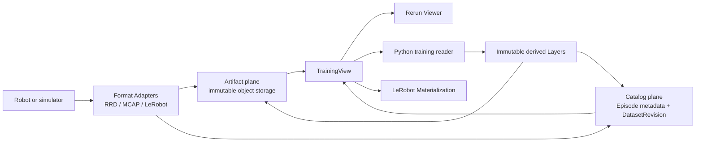

# Robot-training lakehouse

This document defines the product data model that guides Lake's robotics work.
It is a direction and authority contract, not a claim that every named workflow
is implemented today. `goal.md` remains the north star and
`docs/architecture.md` remains the system design.

## Problem

Lake already stores immutable multimodal files and SQL metadata, but it does not
yet define what an Episode or training dataset means. That omission becomes an
observable compatibility bug as soon as two importers exist.

Reproducer:

1. Build one RRD importer and one MCAP importer using only the existing FILE
   contract.
2. Let each importer choose whether an Episode is a file, recording identifier,
   or table row, and whether Lake or an external catalog owns membership.
3. Query both through a future training reader.

Both importers can satisfy the current immutable `DataLocation` rules while
producing datasets that cannot share selection, revisions, splits, layers, or
provenance. The format integration therefore needs a shared domain contract
before it needs format parsers.

## Product outcome

Lake is an open, self-hosted, format-neutral lakehouse for robot-training data.
The complete product loop is:

```text
ingest -> inspect -> select -> freeze -> train -> derive -> compare
```

- Robots and simulators ingest raw recordings once.
- Engineers inspect an Episode with a format-aware tool such as Rerun.
- Training code selects Episodes across a Dataset with SQL.
- A DatasetRevision and TrainingView freeze the exact training input.
- Workers read aligned multimodal samples directly from object storage.
- Predictions, annotations, embeddings, and quality results return as immutable
  Layers with provenance.

Lake does not own model execution or general workflow orchestration. It owns the
data identity and reproducibility underneath those systems.

## Authority

Lake is the sole authority for:

- Dataset membership and access;
- the visible DatasetRevision;
- retained revisions and their lifecycle;
- TrainingView identity, selection, splits, and provenance;
- immutable Artifact identity and reachability;
- the Layer versions selected by a training or evaluation run.

Rerun is a first-class format, visualization, temporal-query, and training
runtime Adapter. Rerun Catalog is not a second source of truth. If an integration
uses a Rerun catalog, its registrations are a rebuildable projection of Lake
state.

This distinction matters because the open-source Rerun server is intended for
small local workflows and stores its catalog in memory, while production-scale
persistent collaboration belongs to Rerun Hub. Lake must not depend on either
one for its durable authority. See the
[Rerun catalog overview](https://rerun.io/docs/howto/query-and-transform/overview).

## Domain language

These terms are canonical across storage, SDK, CLI, and documentation.

### Dataset

A logical collection of related Episodes. The first implementation maps a
Dataset to one authoritative Lake table containing both Episode records and
ArtifactRef records. Publishing both record kinds in one append keeps Dataset
visibility under the existing per-table commit protocol. Dataset does not mean
an object-store directory.

### Episode

The smallest logical trajectory selected, split, and attributed as one unit for
training or evaluation. An Episode has a stable identity independent of file
names, object keys, shard boundaries, and recording formats.

### Artifact

One complete immutable object identified by `DataLocation`. Examples include an
RRD, MCAP, MP4, point-cloud file, Parquet shard, manifest, or model-produced
output. Format metadata is stored beside or above `DataLocation`; the
`DataLocation` identity itself remains unchanged.

Every managed Artifact retained by a DatasetRevision must also appear as a
top-level `FILE` value in an authoritative ArtifactRef record. A URI or digest
embedded inside a manifest describes an object but does not keep it reachable
for managed-object garbage collection.

### Recording

A format-specific representation of time-varying Episode data. One Episode may
use several Recordings, and one physical Recording shard may contain several
Episodes. A Rerun recording is one kind of Recording, not the definition of an
Episode.

### Layer

An immutable logical addition to one or more Episodes. The base Layer preserves
captured data; other Layers may carry annotations, predictions, quality results,
embeddings, or visualization state. Adding a Layer does not rewrite the base
Recording.

### DatasetRevision

An exact, retained version of the authoritative Dataset table. It includes the
table incarnation and engine-defined version needed to prevent drop/recreate
aliasing. A revision is not reproducible until its retention lifecycle prevents
maintenance from reclaiming it.

### TrainingView

A content-addressed training contract over one DatasetRevision. It records the
selection predicate or explicit Episode membership, chosen Layers, train/val/test
split rule, random seed, timeline, sampling window, alignment policy, and schema
fingerprints. Two readers of the same TrainingView must observe the same logical
samples.

### Materialization

A derived physical layout generated from a TrainingView, such as RRD files,
LeRobot Parquet/MP4 shards, codec indexes, or a local cache. A Materialization is
replaceable and rebuildable; it never becomes the authority for the
TrainingView.

## Logical and physical data are separate

The target scale makes a one-Episode-per-object rule unsafe. Logical identities
must not inherit physical layout decisions.

```text
DatasetRevision (one exact Lake table version)
  -> Episode record A
       -> ArtifactRef record: base selector + Artifact 1 FILE
       -> ArtifactRef record: annotation Layer + Artifact 2 FILE
  -> Episode record B
       -> ArtifactRef record: base selector + Artifact 1 FILE
       -> ArtifactRef record: prediction Layer + Artifact 3 FILE
```

Artifact 1 may therefore have several ArtifactRef records without duplicating
its immutable bytes. This explicit relation is also a storage safety rule: the
current managed-object reference extractor discovers top-level `DataLocation`
struct columns, not URIs or digests hidden inside manifest bytes. The first
implementation must write one top-level `FILE` for every durable Artifact. A
future nested reference representation is allowed only after the reference
protocol and GC tests understand it.

This permits both ends of the layout spectrum:

- one RRD per Episode for collection and debugging;
- many Episodes packed into Parquet/MP4 or another shard for training scale.

LeRobotDataset v3 follows the second model: many Episodes share larger
Parquet/MP4 files and per-Episode metadata reconstructs boundaries through
offsets. Lake should interoperate with that layout instead of imposing file
identity on Episode identity. See the
[LeRobotDataset v3 format design](https://github.com/huggingface/lerobot/blob/main/docs/source/lerobot-dataset-v3.mdx).

## Three planes



### Catalog plane

Lake tables contain filterable Episode metadata and immutable Artifact
references. SQL selects across Episodes. Metasrv remains the bounded authority
for per-table commits and revisions; Query caches that state and absorbs read
fan-out.

### Artifact plane

RRD, MCAP, video, point-cloud, manifest, and shard bytes live in object storage.
Clients use full or range reads directly. Query and Metasrv carry only metadata,
never Recording bytes.

### Episode runtime plane

Viewer and training Adapters interpret the bytes. They may align timelines,
decode media, or materialize a new layout, but they do not own Dataset membership
or revision state. This plane is stateless or reconstructible and may scale with
training demand.

## Two-level query model

Robot training needs two different query semantics.

1. **Cross-Episode selection.** Lake SQL filters Dataset rows by task, robot,
   success, quality, capture time, embodiment, or other Episode properties.
2. **Within-Episode sampling.** A format Adapter aligns entities, components,
   and sensor timelines, decodes frames, and returns temporal windows.

Rerun is well suited to the second level. Its data model uses entities,
components, and multiple timelines, and its dataframe reader aligns sparse
multirate data on a selected timeline. See
[Rerun dataframe queries](https://rerun.io/docs/concepts/query-and-transform/dataframe-queries).

Lake does not flatten every high-frequency sensor update into a global SQL row.
Doing so would discard sparse timeline semantics, multiply row counts, and make
the catalog responsible for work that belongs in a format-aware runtime.

## Initial format Adapters

### Rerun RRD

RRD is the first visualization and temporal-query Adapter. An RRD footer carries
chunk offsets plus component, timeline, and schema statistics, so a reader can
use bounded range reads instead of downloading an entire Artifact. See the
[RRD format](https://rerun.io/docs/concepts/logging-and-ingestion/rrd-format).

The Adapter records the producer version because Viewer compatibility tracks
the RRD version. It extracts only Episode-level searchable properties into Lake;
detailed chunk metadata remains in the RRD footer or an immutable sidecar.

An RRD-backed Rerun segment normally maps to one Lake Episode, but that mapping
is an Adapter rule rather than a core storage invariant. RRD Materializations
generated from MCAP or LeRobot data are derived and rebuildable.

### MCAP

MCAP is an initial capture/archive Adapter, particularly for ROS 2. Lake keeps
the original MCAP as an immutable Artifact and extracts Episode-level topic,
schema, time-range, and attachment summaries. Rerun-compatible views may be
materialized without replacing the original bytes. MCAP has a published format
specification and conformant libraries for Rust, Python, C++, and other
languages; see the [MCAP specification](https://mcap.dev/spec).

### LeRobot

LeRobot is an initial training interchange and Materialization Adapter. Lake
imports its Episode metadata and shared Parquet/MP4 shards without assuming one
file per Episode. Export produces a pinned layout from a TrainingView, not an
independent mutable dataset.

An Adapter seam is real only after at least two implementations exercise it.
The first contract work must therefore validate RRD together with MCAP or
LeRobot instead of embedding Rerun types in Lake's core modules.

## Episode metadata shape

The first behavioral specification should keep searchable values scalar and
put extensible structure in an immutable manifest Artifact. The Dataset table
needs two logical record kinds. An Episode record is the selectable summary:

```text
record_kind = episode
episode_id
robot_id
embodiment
task
started_at
duration_ns
num_steps
success
quality_score
manifest_artifact_id
```

Each object reachable from that Episode has an ArtifactRef record in the same
table version:

```text
record_kind = artifact_ref
episode_id
artifact_id
layer_id
role
recording_format
selector
object FILE
schema_fingerprint
producer_version
```

The manifest itself has an ArtifactRef record whose `role` is `manifest`; base
recordings, media shards, sidecar indexes, and derived Layer outputs each have
their own record. The exact Arrow encoding of the two record kinds belongs to
the behavioral spec, but every `object FILE` must remain a top-level exact
`DataLocation` struct until the GC reference protocol explicitly supports a
different representation.

The structured Episode manifest describes Recording selectors, timelines,
streams, codecs, Layers, and optional sidecar indexes. Scalar columns are a
query acceleration surface, not a competing source of truth: values derived
from the manifest must be bound to its digest and rejected when inconsistent.
The manifest's internal references never replace ArtifactRef records.

`DataLocation` continues to identify one complete immutable object with URI,
media type, exact size, and SHA-256. Adding Rerun fields to its Arrow shape would
couple object GC and every storage engine to one format, so format information
must remain in sibling columns or the Episode manifest. Conversely, putting a
`DataLocation` only inside the manifest would hide it from current object
reference accounting, so durable object identity remains in the top-level
`object FILE` column.

## Lifecycle

### Ingest

The client-side or stateless ingestion Adapter reads local/source bytes,
validates format metadata, builds the Episode manifest, uploads Artifacts, and
only then appends the Episode record plus one ArtifactRef record per uploaded
object in the same Dataset-table commit. Missing or unrepresentable references
fail closed. Query and Metasrv receive `DataLocation` values and scalar metadata,
not source bytes.

### Inspect

Lake authorizes an Episode and mints a bounded direct-read capability. An RRD
may open directly in the Rerun Viewer. Other formats may use a local importer or
a derived RRD Materialization. The durable object URI is never itself treated as
a credential.

### Freeze

The caller selects Episodes against an exact DatasetRevision and creates a
content-addressed TrainingView. Creating the view also establishes the retention
needed to replay it after ordinary table maintenance.

### Train

Python workers load the TrainingView, partition Episode/sample identities
deterministically, and read Artifact ranges directly. No per-sample request may
reach Metasrv. Codec and chunk indexes are immutable sidecars bound to the base
Artifact digest.

### Derive

Training, evaluation, and annotation jobs append new Layers with producer and
input provenance and GC-visible ArtifactRef records in the same commit. They do
not mutate a base Recording. A later TrainingView selects exact Layer versions
explicitly.

## Delivery sequence

### 0. Domain contract

- Define a versioned Episode manifest.
- Define the Episode/ArtifactRef table contract and prove GC retains every
  multi-Artifact reference.
- Add a generic typed Arrow append path rather than extending the narrow SQL
  parser one scalar at a time.
- Prove the format seam with at least two Adapters.

### 1. Inspectable Episodes

- Extract RRD and second-format metadata at ingest.
- Add a read-only Python client for Flight SQL, `DataLocation`, and range reads.
- Open authorized RRD Artifacts in a version-matched Rerun Viewer.

### 2. Reproducible datasets

- Expose exact DatasetRevision reads.
- Add durable retain/release semantics.
- Create content-addressed TrainingViews with deterministic splits and
  provenance.

### 3. Training-native reads

- Add PyTorch iterable and map-style readers.
- Support timeline alignment, temporal windows, deterministic shuffle, worker
  prefetch, local caching, and disjoint distributed partitions.
- Import and materialize LeRobot v3 layouts.

Rerun's current PyTorch dataloader is experimental, so Lake must keep its public
TrainingView contract stable and isolate that dependency behind the Adapter.
See the [Rerun training guide](https://rerun.io/docs/howto/train/dataloader).

### 4. Feedback loop

- Add immutable annotation, prediction, quality, and embedding Layers.
- Record code, model, parameter, source-view, and schema provenance.
- Add data-quality checks before considering format-specific or vector indexes.

### 5. Scale and governance

- Publish reproducible table-count, Episode-count, fan-out, and failure tests.
- Add cluster-level resource accounting, dynamic identity, grants, and audit.
- Keep the read flood on Query and object storage, never Metasrv.

## Deliberate non-goals

- Reimplementing or forking Rerun Hub.
- Making Rerun Catalog authoritative.
- Requiring one RRD or object per Episode.
- Flattening all sensor events into one global SQL table.
- Putting Rerun types in `lake-engine`, `lake-metasrv`, or `DataLocation`.
- Proxying Recording bytes through Query or Metasrv.
- Building a general model-training orchestrator, annotation application, or ETL
  platform.
- Adding general cross-table transactions for dataset freezing.

These constraints preserve Lake's original bet: stateless read fan-out in front
of a bounded metadata authority, with immutable bytes in disaggregated object
storage.
